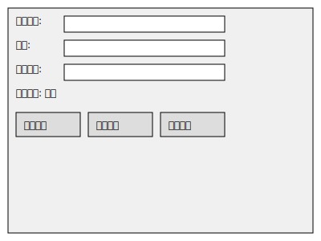

# 系统代理设置工具



这是一个用于Windows系统的代理设置工具，通过修改注册表来设置系统代理。

## 功能

- 设置系统代理服务器地址和端口
- 设置代理排除地址
- 测试网络连接状态
- 一键关闭系统代理
- 实时显示当前代理状态

## 安装

1. 确保系统已安装Python 3.7或更高版本
2. 克隆本项目：
   ```
   git clone https://github.com/yourusername/proxy-setup.git
   ```
3. 安装依赖：
   ```
   pip install -r requirements.txt
   ```

## 使用

1. 运行程序：
   ```
   python proxy_setup.py
   ```
2. 在界面中输入代理地址和端口
3. 点击"设置代理"按钮
4. 使用"测试连接"按钮检查网络状态
5. 点击"关闭代理"按钮可关闭系统代理

## 注意事项

- 需要以管理员权限运行
- 修改系统代理可能会影响网络连接，请谨慎使用